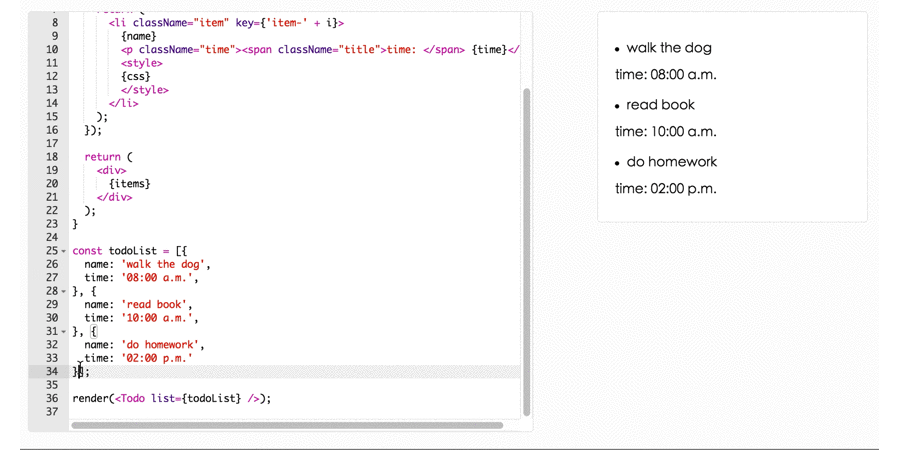

# react-doc

when you write a API guide to people, why not let people try themself !



[demo](http://jasonHzq.github.io)

## install

```
npm i --save react-doc
```

## usage

```
const code = `
  const Todo = function(props) {
  ...
`;

<Doc code={code} />
```

## API

<table class="table table-bordered table-striped">
    <thead>
    <tr>
        <th style="width: 50px">name</th>
        <th style="width: 100px">type</th>
        <th style="width: 50px">default</th>
        <th style="width: 50px">description</th>
    </tr>
    </thead>
    <tbody>
        <tr>
          <td>backCode</td>
          <td>string</td>
          <td>''</td>
          <td>the code not show in the editor</td>
        </tr>
        <tr>
          <td>code</td>
          <td>string</td>
          <td>''</td>
          <td>the code show in the editor</td>
        </tr>
        <tr>
          <td>debounceWaitTime</td>
          <td>number</td>
          <td>500</td>
          <td>the code compiling debounce time</td>
        </tr>
        <tr>
          <td>showGutter</td>
          <td>bool</td>
          <td>true</td>
          <td>show the row number</td>
        </tr>
    </tbody>
</table>

## License

[MIT](http://opensource.org/licenses/MIT)
